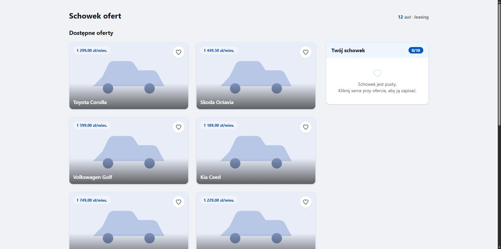
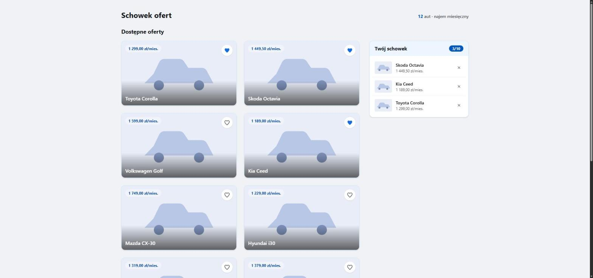
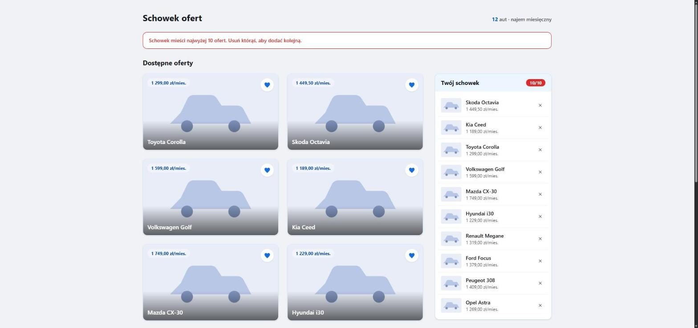
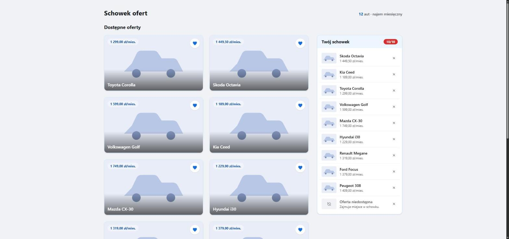
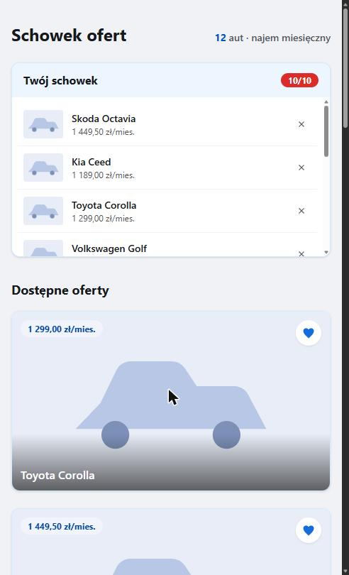

# Schowek ofert

Schowek ofert samochodowych dla anonimowych odwiedzających. Symfony 7.4, PHP 8.4,
Ecotone (CQRS/messaging), Doctrine ORM, MariaDB, Tailwind 4.

- [task-1-shortlist](task-1-shortlist/) - implementacja (szczegóły w [README](task-1-shortlist/README.md))

## Widoki

### Pusty schowek

### Schowek z zapisanymi ofertami

### Pełny schowek (10/10) i próba dodania kolejnej oferty

### Oferta wycofana z katalogu, wciąż zajmująca miejsce

### Widok mobilny

# Code Review
- [task-2-code-review](task-2-code-review/) - code review ([REVIEW.md](task-2-code-review/REVIEW.md))
