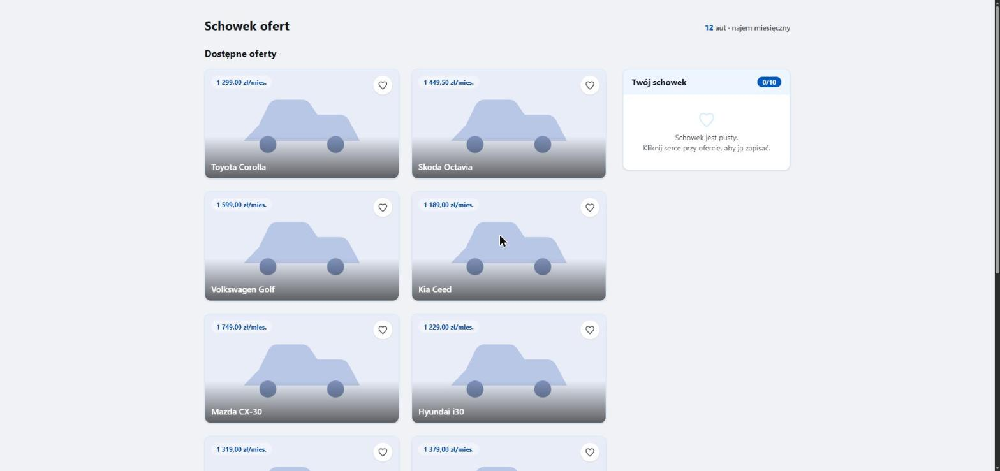

# Schowek ofert

Schowek ofert samochodowych dla anonimowych odwiedzających. Symfony 7.4, PHP 8.4,
Ecotone (CQRS/messaging), Doctrine ORM, MariaDB, Tailwind 4.

## Uruchomienie

Wszystko działa w Dockerze (`make` opakowuje `docker compose`):

```bash
make start   # build, instalacja, migracje, CSS, serwer na http://localhost:8000
make test    # pełny zestaw testów PHPUnit
make db      # migracja bazy dev i testowej
```

## Widoki

### Pusty schowek



### Schowek z zapisanymi ofertami


### Pełny schowek (10/10) i próba dodania kolejnej oferty


### Oferta wycofana z katalogu, wciąż zajmująca miejsce


### Widok mobilny


